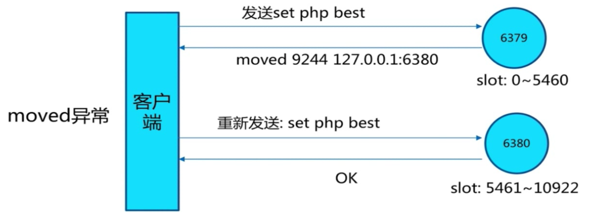

### Redis Cluster，原生安装
1、配置开启节点（启动）
```shell
port ${port}
daemonize yes
dir "/opt/redis/redis/data"
dbfilename "dump-${port}.rdb"
logfile "${port}.log"
cluster-enabled yes
# 用于记录节点之间的关系信息
cluster-config-file nodes-${port}.conf
# 很关键的默认配置
cluster-node-timeout 15000
# 当有节点不可用时，使集群都不可用，生产都用no
cluster-require-full-coverage no
```

2、meet（机器之间的握手）
```shell
redis-cli -h 127.0.0.1 -p 7000 cluster meet 127.0.0.1 7001
redis-cli -h 127.0.0.1 -p 7000 cluster meet 127.0.0.1 7002
redis-cli -h 127.0.0.1 -p 7000 cluster meet 127.0.0.1 7003
redis-cli -h 127.0.0.1 -p 7000 cluster meet 127.0.0.1 7004
redis-cli -h 127.0.0.1 -p 7000 cluster meet 127.0.0.1 7005
redis-cli -h 127.0.0.1 -p 7000 cluster meet 127.0.0.1 7006
```
让所有机器都给一台机器握手后，就互相感知了

3、指派槽
```shell
redis-cli -h 127.0.0.1 -p 7000 cluster addslots {0...5461}
redis-cli -h 127.0.0.1 -p 7001 cluster addslots {5462...10922}
redis-cli -h 127.0.0.1 -p 7002 cluster addslots {10923...16383}
```

4、设置主从
```shell
redis-cli -h 127.0.0.1 -p 7003 cluster replicate ${node-id-7000}
redis-cli -h 127.0.0.1 -p 7004 cluster replicate ${node-id-7001}
redis-cli -h 127.0.0.1 -p 7005 cluster replicate ${node-id-7002}
```

### Redis Cluster Ruby脚本进行集群
```shell
./redis-trib.rb create --replicas 1 127.0.0.1:7000 127.0.0.1:7001 127.0.0.1:7002 \
127.0.0.1:7003 127.0.0.1:7004 127.0.0.1:7005
```

### 集群扩容步骤
- 准备新节点

> 新节点：
- 集群模式
- 配置和其他节点统一
- 启动后是孤儿节点

- 加入集群
```shell
redis-cli -p 7000 cluster meet 127.0.0.1 7006
redis-cli -p 7000 cluster meet 127.0.0.1 7007
```
将两个新节点加入到集群中
```shell
# 进行主备，将7007这个实例做<run_id>的副本
redis-cli -p 7007 cluster replicate <run_id>
```

- 通过redis提供的ruby脚本，迁移槽和数据，脚本会根据
```shell
./redis-trib.rb reshard 127.0.0.1:7000
```

### 集群下线
- 下线迁移槽


- 忘记节点
```shell
# 连接集群，下线制定run_id的从节点
./redis-trib.rb del-node 127.0.0.1:7000 <run_id>
```
- 关闭节点

### 集群的Moved和ASK重定向异常
Set数据时，key不是在指定的节点


ASK重定向，在槽迁移时，或者迁移后，客户端未对槽信息进行更新


### Cluster 集群运维常见问题
1、集群完整性
- cluster-require-full-coverage默认yes
    - 集群中16384个槽全部可用：保证集群完整性
    - 节点故障或者正在故障转移： （error）CLUSTERDOWN The cluster is down
- 大多数业务无法容忍，所以cluster-require-full-coverage建议配置成no

2、带宽消耗
- 官方建议： 不要超过1000个节点
- PING/PONG消息
- 不容忽视的带宽消耗

    3个方面觉得带宽的消耗：
    1、消息发送频率：节点发现与其他节点最后通信时间超过cluster-node-timeout/2时会直接发送ping消息
    2、消息数据量： slots槽数组(2kb空间)和整个集群1/10的状态数据
    3、节点部署的机器规模：集群分布的机器越多且每台机器划分的节点数越均匀，则集群内整体的可用带宽越高。即：条件允许，使用尽量多的机器，主从分布到各台机器尽量均匀，可以有效提高网络带宽可用率。

优化：
- 避免“大”集群：避免多业务使用一个集群，大业务可以多集群
- cluster-node-timeout: 带宽和故障转移速度的均衡
- 尽量均匀分配到多机器上：保证高可用和带宽

3、Pub/Sub广播会推送到各个节点？影响到带宽？

4、集群倾斜问题
-数据倾斜： 内存不均匀
```shell
redis-trib.rb info ip:port 查看节点、槽、键值分布
redis-trib.rb rebalance ip:port 进行均衡（谨慎使用）
```
-请求倾斜： 特定Key请求频率很高
  
-节点和槽分配不均

-不同槽对应键值数量差异较大
 可能存在hash_tag
 cluster countkeysinslot {slot} 获取槽对应键值个数

-包含bigkey
  排查方式：  从节点上执行 redis-clit --bigkeys
  优化： 优化数据结构

-内存相关配置不一致

怎么排查节点和槽分配不均？

### 数据离线/在线迁移
- 官方迁移工具：redis-trib.rb import

- 在线迁移：
  - 唯品会： redis-migrate-tool
  - 豌豆荚： redis-port

### 集群限制
- key批量支持有限制：例如mget/mset必须在同一个槽
- key事务和lua支持有限： 操作的key必须在一个节点，如果要使用lua脚本，可以使用hash_tag
- 不支持多数据库，只有数据库0

### 分布式Redis不一定好
1、Redis Cluster：满足容量和性能的扩展性，很多业务“不需要
2、很多场景Redis Sentinel就足够好。

